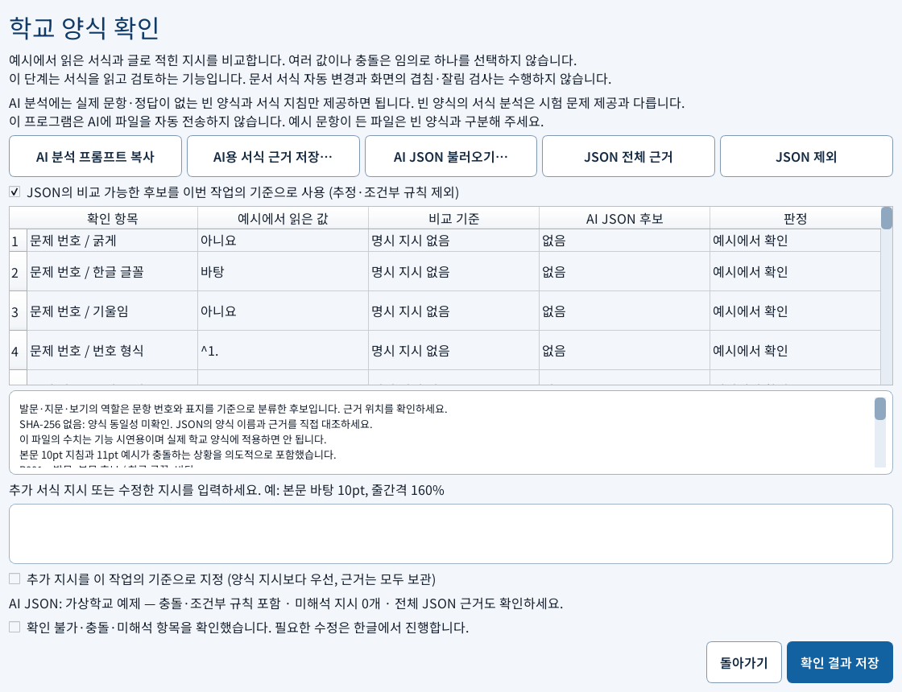

# HWPExamAssembler

여러 교사가 작성한 HWP/HWPX 시험 문항을 학교 양식에 수합하고 문항 순서·번호·난이도를 편집하는 Windows용 도구입니다. 수식·그림·표·글상자는 한글 Automation의 네이티브 복사·붙여넣기로 옮깁니다.

현재 배포 버전은 **v0.2.0-alpha**입니다. 결과 시험지는 한글에서 직접 검토해 주세요.

## 다운로드와 실행

1. [v0.2.0-alpha 다운로드](https://github.com/CauchyRiemannEquations/HWPExamAssembler/releases/tag/v0.2.0-alpha)에서 `HWPExamAssembler-v0.2.0-alpha-windows-portable.zip`을 받습니다.
2. ZIP을 완전히 압축 해제하고 `HWPExamAssembler.exe`를 실행합니다. 같은 폴더의 `_internal`은 그대로 둡니다.
3. Windows와 한컴오피스 한글이 필요하며 Python은 설치하지 않아도 됩니다. Windows 11·한글 2022 계열에서 검증했습니다.

GitHub의 `Source code (zip)`은 실행 프로그램이 아닙니다. 별도 `AI-template-analysis-v1.zip`에는 분석 프롬프트·JSON 규격·빈 입력 양식·가상 예제가 있습니다. `SHA256SUMS.txt`로 배포 파일 무결성을 확인할 수 있습니다.

## 이번 버전에서 추가한 기능

- 학교 전용판과 같은 **시험지 수합 / 시험지 편집** 시작 화면과 난이도 편집 흐름
- 학교 양식의 번호·글꼴·글자 크기·줄간격·보기 구성·상자·그림 속성 근거 확인
- 줄글로 명시된 서식 지시와 실제 예시 비교, 충돌·미해석 항목 표시
- 개인 AI가 만든 분석 JSON 가져오기, 전체 근거 확인, 비교 기준 선택
- 43개 기본 점검 항목을 포함한 상세 AI 프롬프트와 원본 서식 근거 내보내기
- 저장 후 다시 읽은 수합본의 지원 속성을 선택한 기준과 비교

## 빈 양식 분석과 시험 문제 제공은 다릅니다

**실제 문항·정답이 없는 빈 학교 양식을 GPT 등으로 분석하는 것은 시험 문제를 제공하는 일이 아닙니다.** 번호·폰트·줄간격·여백·상자 구조를 분석하는 데 실제 출제 파일이나 완성 시험지는 필요하지 않습니다.

**이 프로그램은 AI에 파일을 자동 전송하지 않습니다.** 수합·편집·서식 추출·JSON 검증은 PC에서 처리합니다. 개인 AI 사용은 선택 사항이며 사용자가 빈 양식과 지침을 직접 제공한 후, 분석 결과 JSON만 앱으로 가져옵니다. AI 없이도 사용할 수 있습니다.

예시 문항·정답이 포함된 파일은 빈 양식과 구분해 주세요. 이 설명은 외부 AI 서비스의 자료 보관·처리까지 무조건 보장한다는 뜻은 아닙니다. [문서 처리 안내](PRIVACY.md)에 처리 범위를 설명했습니다.

## 사용 순서

1. **시험지 수합**에서 학교 양식과 새 수합본 경로를 지정합니다.
2. **학교 양식 인식 결과**에서 실제 서식·지시문·근거·충돌을 확인합니다.
3. 개인 AI를 사용한다면 **AI 분석 프롬프트 복사 → 빈 양식 분석 → AI JSON 불러오기**를 진행합니다. 비교할 후보를 선택하고 확인 결과를 저장합니다.
4. 한글에서 양식 예시 영역과 마지막 고정 블록을 확인한 뒤 출제 파일을 추가합니다.
5. 수합본을 저장하면 지원 서식 속성을 다시 대조합니다. 문항 순서·삭제·난이도는 편집 화면에서 지정합니다.
6. 한글에서 직접 수정한 뒤 저장하고, 앱에서 편집 완료 후 다시 읽어 후속 편집을 진행합니다. 최종 결과는 한글에서 검수합니다.

[사용안내](사용안내.txt) · [학교 양식 확인 상세 안내](docs/template-format-review.md) · [개인 AI 사용 순서](docs/ai-template-profile.md) · [분석 프롬프트](ai-template/analysis-prompt.txt)

## 현재 범위와 검증

분석·대조 기능이며 모든 문항의 서식을 자동 변경하지는 않습니다. 그림의 개별 위치 좌표·배치 기준·여백·테두리와 페이지 설정은 AI JSON에 보관해 검토할 수 있지만 현재 자동 비교에는 연결하지 않았습니다. 화면상의 겹침·잘림·줄바꿈도 한글에서 확인해야 합니다. 역할 분류와 AI가 기록한 근거는 원본과 대조해야 합니다.

20개 자동 테스트 파일 통과, 실제 학교 문서가 필요한 기존 시험 1개 제외. 실제 한글에서 합성 2문항 수합, 원본 보존, AI JSON 기준을 포함한 4개 규칙 대조, 검토 기록 저장, HWPX 저장·재개방을 확인했습니다. [검증 결과](docs/verification.json)

## 배포 형태

이 저장소는 **배포 전용 저장소**입니다. 실행 파일은 GitHub Releases로 제공하며 개발 소스, 실제 학교 양식, 출제 문서는 포함하지 않습니다. AI JSON 예제는 가상 수치이며 실제 학교 규칙으로 적용하면 안 됩니다.
